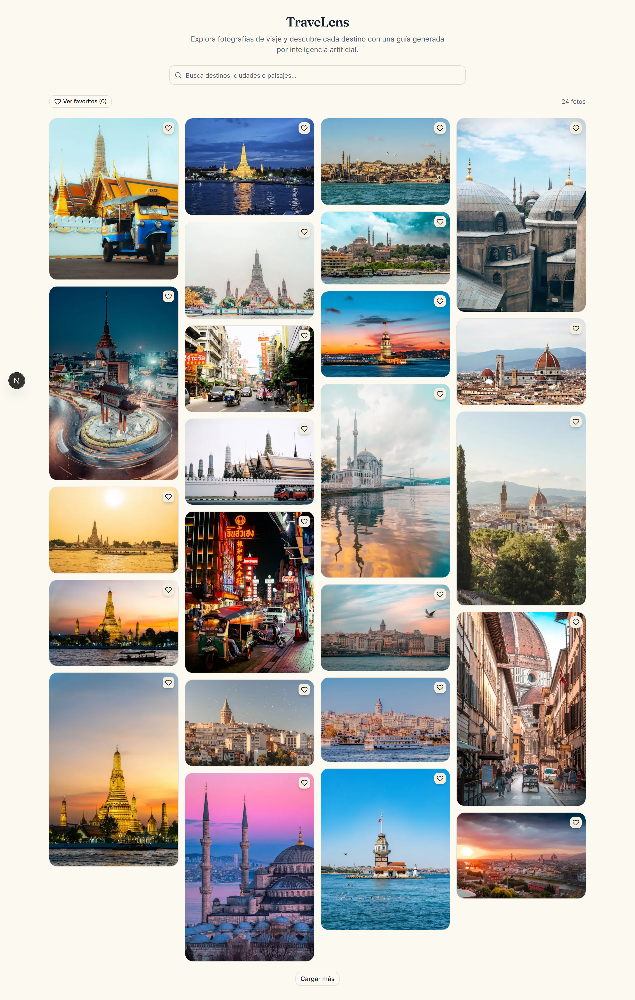
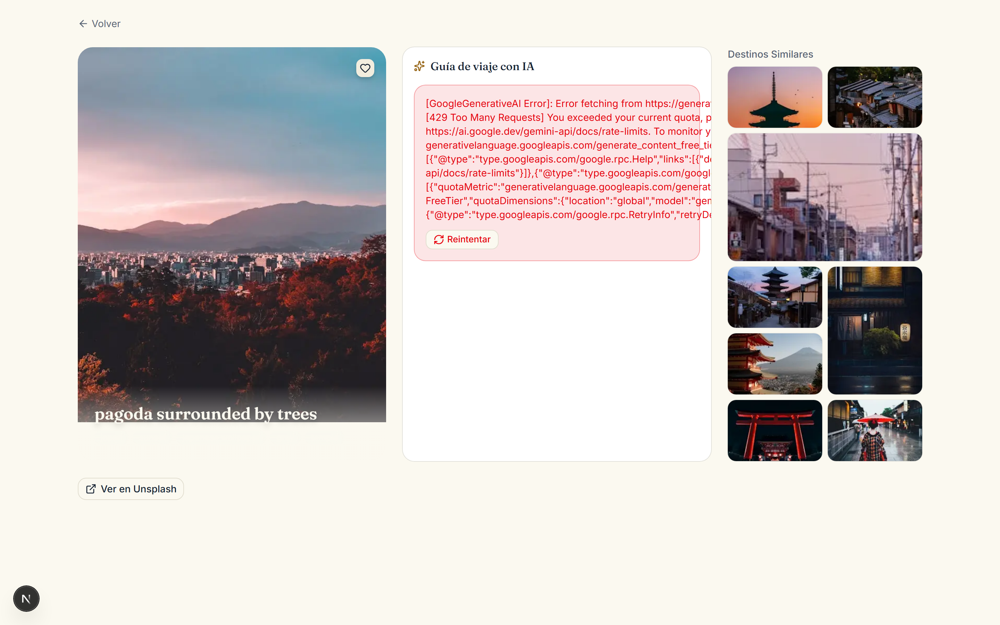

# TraveLens

**Premium travel photo explorer with AI-powered destination guides.**

Browse curated travel photography from the world's top cities, discover hidden gems, and receive personalized itineraries generated by Google Gemini — all with a single search.



---

## Demo

<video controls width="100%" autoplay muted loop>
  <source src="assets/demo.webm" type="video/webm">
  Demo: Search "kyoto" → grid updates → click a photo → AI travel plan loads → destination detail with hero, plan, and similar destinations
</video>

> **What you see**: The homepage shows popular travel photos from curated cities. The search bar updates the grid in real-time with debounced input synced to URL query parameters. Hovering a card reveals a title overlay. Clicking navigates to a destination detail page with a hero image, AI-generated travel plan, and a bento mosaic of similar destinations.

---

## Features

| Feature | Implementation |
|---|---|
| **Masonry grid** | CSS columns (`columns-1 sm:columns-2 lg:columns-3 xl:columns-4`) with staggered fade-in animation on load |
| **Hover overlays** | Title + description appear only on hover (`group-hover:opacity-100`) with a scrim gradient for legibility |
| **Keyboard navigation** | Arrow keys, Home/End navigate between grid cards; roving tabindex pattern |
| **Favorites** | Heart button with localStorage persistence via `useSyncExternalStore`; animated heart-burst effect on save |
| **Recent searches** | Last 8 queries stored in localStorage; clickable chips below the search bar |
| **Real-time search** | 300ms debounced input synced to URL `?q=` param; `userInteractedRef` prevents programmatic debounce triggers |
| **Destination detail** | 3-panel layout: hero (60vh image + title + tags), AI travel plan (Card + Spinner), bento similar sidebar |
| **AI travel plan** | Structured JSON via Gemini (`responseSchema`): intro, 3-day itinerary, hidden gem, local food as Badges |
| **Bento sidebar** | CSS Grid mosaic (`grid-cols-2 auto-rows-[88px]`) with varied spans (2×2, 1×2, 1×1) for visual variety |
| **Text pipeline** | Server-side cleaning: strips photo IDs/filenames, deduplicates city names, humanizes Spanish slugs |



---

## Architecture

```
src/
├── App.tsx                             # Autograder/test entry: Next-free homepage + offline fixtures
├── __tests__/app.test.tsx              # DoD behavioral tests (favorites, burst, stagger, keyboard, chips)
├── fixtures/photos.ts                  # Offline fallback feed (mirrors UnsplashPhoto shape)
├── app/
│   ├── page.tsx                        # Homepage: popular fetch + search + masonry grid
│   ├── destination/[id]/
│   │   ├── page.tsx                    # Server component: fetches photo → DestinationView
│   │   └── not-found.tsx               # Custom 404 page
│   └── api/
│       ├── photos/popular/route.ts     # GET ?page= → fetchPopular (3 random cities)
│       ├── photos/related/route.ts     # POST → fetchRelated (2-query strategy)
│       ├── photos/route.ts             # GET ?q=&page= → searchDestinations
│       ├── photos/[id]/route.ts        # GET → single photo
│       └── ai-plan/route.ts            # POST → Gemini TravelPlan
├── services/
│   ├── unsplash.ts                     # Server-only. Text pipeline, fetchPopular, searchDestinations, fetchRelated
│   └── gemini.ts                       # Server-only. @google/generative-ai SDK, TravelPlan output
├── components/
│   ├── features/
│   │   ├── search-bar.tsx              # Debounced input + recent search chips
│   │   ├── masonry-grid.tsx            # CSS-column grid + keyboard navigation
│   │   ├── photo-card.tsx              # Image + hover overlay + favorites heart
│   │   ├── destination-view.tsx        # 3-panel layout (hero + plan + similar)
│   │   ├── travel-plan-panel.tsx       # AI plan fetch + render (Card, Badge, Spinner)
│   │   └── similar-grid.tsx            # Bento mosaic with POST /api/photos/related
│   └── ui/                             # shadcn base-nova primitives
├── hooks/
│   ├── use-favorites.ts                # localStorage via useSyncExternalStore (cached snapshots)
│   └── use-recent-searches.ts          # localStorage via useSyncExternalStore (max 8)
├── lib/
│   ├── types.ts                        # UnsplashPhoto, TravelPlan, PaginatedPhotos, ApiError
│   └── utils.ts                        # cn() helper
└── scripts/
    └── capture-media.mjs               # Playwright automated screenshots + demo capture
```

### BFF Pattern

All API keys live server-side. Client components fetch `/api/*` route handlers, which proxy external requests to Unsplash and Gemini. The `server-only` import guard prevents service files from being imported in client components.

### Data Flow

```
User types → SearchBar (300ms debounce) → page.tsx pushes URL ?q= → useEffect calls /api/photos?q= →
  service: unsplash.ts searchDestinations() → Unsplash REST → normalize → JSON response →
  MasonryGrid renders PhotoCards with displayTitle/displaySubtitle
```

Click a card → `/destination/[id]` → server fetches photo via `getPhoto()` → passes to `DestinationView` →
  TravelPlanPanel POSTs `/api/ai-plan` with photo context → Gemini SDK → structured TravelPlan →
  rendered as Cards + Badges in the right panel

---

## API Connection

### Unsplash API

**Connection**: The `request<T>()` generic helper in `unsplash.ts` establishes the connection with two headers:
- `Authorization: Client-ID ${UNSPLASH_ACCESS_KEY}` — authentication
- `Accept-Version: v1` — API version pinning

**Caching**: Every fetch includes `next: { revalidate: 3600 }` (1-hour ISR cache). This is critical — the demo key has a 50 req/hr limit, and the `fetchPopular` function makes 3 parallel calls per homepage load.

**Request building**: `URLSearchParams` builds query strings for `/search/photos` (`query`, `page`, `per_page`, `content_filter`) and `/photos/:id` (direct fetch).

**JSON paths**:
- Search results: `data.results[]` → array of `UnsplashRawPhoto` objects
- Single photo: direct JSON object
- Both are normalized via `normalize()` which extracts `urls.{thumb,small,regular}`, `alt_description`, `alternative_slugs.es`, `location`, `tags`, and computes `displayTitle`/`displaySubtitle`/`cityName`

**Error mapping**: `401` → "rejected key" (502), `403` → "rate limit" (429), other → generic 502 with status code.

### Google Gemini API

**Connection**: Uses the `@google/generative-ai` SDK v0.24.1:
```ts
const genAI = new GoogleGenerativeAI(API_KEY)
const model = genAI.getGenerativeModel({ model: "gemini-3-flash-preview", ... })
```

**Structured output**: The API enforces JSON schema compliance server-side:
- `responseMimeType: "application/json"` — tells Gemini to return JSON
- `responseSchema` — declares the exact `TravelPlan` shape using `SchemaType` enums. The API rejects malformed output before it reaches our code.

**Prompt construction**: `buildPrompt()` embeds the photo's `displayTitle`, `altDescription`, `tags`, `cityName`, and `photographer` into a Spanish-language instruction. The model receives a `systemInstruction` as a luxury travel writer persona.

**JSON path**: `model.generateContent(prompt)` → `result.response.text()` → `JSON.parse()` → defensive validation of `{ intro, days[3], hiddenGem, localFood[] }`. Timeout: 20 seconds.

### Image ↔ Plan Synchronization

The travel plan is generated **specifically for each photo** through a context-passing chain:

1. **Server component** (`destination/[id]/page.tsx`) fetches the photo via `getPhoto(id)`, which computes `displayTitle` (cleaned description) and `cityName` (extracted from Unsplash's `location` field)
2. **DestinationView** passes the photo's `displayTitle` + context (`altDescription`, `tags`, `photographer`, `cityName`) to `TravelPlanPanel`
3. **TravelPlanPanel** POSTs to `/api/ai-plan` with the photo context
4. **BFF route** validates inputs (length caps) and calls `generateTravelPlan(destination, context)`
5. **Gemini prompt** embeds the photo's context — "an itinerary for Kyoto, autumn temple photos, tags: temple, japan, autumn" — so each plan is contextually relevant to the specific image displayed
6. The structured JSON response is rendered as day cards, a hidden gem highlight, and local food badges

---

## Setup

### Prerequisites

- Node.js ≥ 20.9
- pnpm ≥ 10

### 1. Install dependencies

```bash
pnpm install
```

### 2. Configure environment variables

Copy the example file and fill in your keys:

```bash
cp .env.example .env.local
```

| Variable | Source | Required |
|---|---|---|
| `UNSPLASH_ACCESS_KEY` | [unsplash.com/developers](https://unsplash.com/developers) | Yes |
| `GEMINI_API_KEY` | [aistudio.google.com/app/apikey](https://aistudio.google.com/app/apikey) | Yes |
| `GEMINI_MODEL` | Optional override (default: `gemini-3-flash-preview`) | No |

### 3. Run the development server

```bash
pnpm dev
```

Open [http://localhost:3000](http://localhost:3000).

### 4. Run the tests

```bash
pnpm test
```

23 tests (Vitest + Testing Library + jsdom): unit tests for both persistence hooks (`renderHook` + `act`) and behavioral tests for the Definition of Done features (favorites persistence, heart/confetti burst, staggered fade-in, keyboard navigation, recent-search chips).

Note: `src/App.tsx` is the test/grader entry point — a Next-free mirror of the homepage with an offline fixture fallback, so the full UI works without API keys in a sandboxed environment.

### 5. Capture media assets (optional)

```bash
npx playwright install chromium
node scripts/capture-media.mjs
```

Saves `assets/screenshot-home.png`, `assets/screenshot-destination.png`, and `assets/demo.webm`.

---

## Role Contribution Log

| Role | Description | Key Deliverables |
|---|---|---|
| **1. System Architect** | Project scaffold, BFF pattern, services layer, component hierarchy, theme tokens | `next.config.ts`, `package.json`, shadcn setup, `globals.css` theme, folder structure |
| **2. UI/UX Frontend Developer** | Homepage grid, hover overlays, search bar, detail page layout, favorites/animations | `page.tsx`, `photo-card.tsx`, `masonry-grid.tsx`, `search-bar.tsx`, `destination-view.tsx`, `travel-plan-panel.tsx`, `similar-grid.tsx` |
| **3. Backend Developer** | Unsplash service rewrite, BFF routes, fetchPopular/searchDestinations/fetchRelated | `unsplash.ts`, `/api/photos/popular`, `/api/photos/related`, `/api/photos/route.ts`, `/api/photos/[id]/route.ts` |
| **4. Data Specialist (AI Integration)** | Gemini SDK rewrite, TravelPlan schema, structured output, /api/ai-plan | `gemini.ts`, `/api/ai-plan/route.ts`, `TravelPlanPanel.tsx` |
| **5. QA & Code Reviewer** | Lint fixes, a11y (aria-labels, role=listitem), dead code removal, REVIEWER_NOTE comments | Deleted `detail-panel.tsx`, added `role="listitem"`, 9 REVIEWER_NOTE comments, fixed `set-state-in-effect` errors |
| **6. API Connection Explanation** | Analysis of Unsplash/Gemini connections, request building, JSON paths, sync logic | This README's "API Connection" section |
| **7. Automated Media Capture** | Playwright screenshots + demo video | `scripts/capture-media.mjs`, `assets/` directory |
| **8. Technical Documentation** | README rewrite, architecture docs, setup guide, role log | This `README.md` |

---

## Tech Stack

| Layer | Technology | Version |
|---|---|---|
| Framework | Next.js (App Router, Turbopack) | 16.3.3 |
| React | React | 19.2.8 |
| Language | TypeScript | 5.9.3 (strict) |
| Styling | Tailwind CSS | 4.3.3 |
| Components | shadcn (base-nova) + Lucide React | — |
| AI | @google/generative-ai (Gemini SDK) | 0.24.1 |
| Photos | Unsplash API | v1 |
| Testing | Playwright (screenshots) | 1.62.1 |

---

## License

Private project. Photography courtesy of [Unsplash](https://unsplash.com) contributors.
